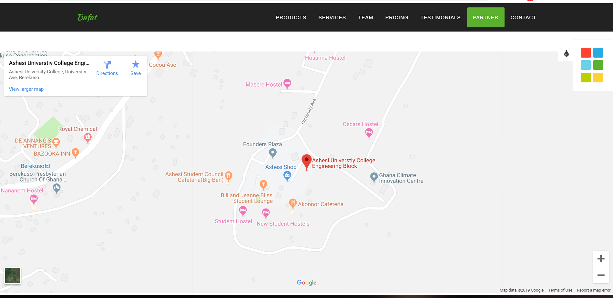

# Website-Tutorial
Developers Student Club is an Google organization for Student Developers to learn new programming technologies and solve real life problems. 
In preparation for our project showcase, students were taken through how to use a simple Bootstrap template to make an advertisement website for a restaurant called Bufat.

# Features
The website has slideshows for the different services offered by the restaurant. 

It also has a google embeded. 

# How to embed a google map in a website 
1. go to google.com/maps
2. Type the location 
3. Once the location loads on the map, click on share
4. Another small window appears, click on embed a map.
5. Copy the html code and add to your website hmtl file

# Credits
The bootstrap template was obtained from [here](https://themefisher.com/products/fame-free-html-website-template/#download-area?edd_action=free_downloads_process_download&download_id=29695&price_ids=1&edd_action=free_downloads_process_download&download_id=29695&price_ids=1)

